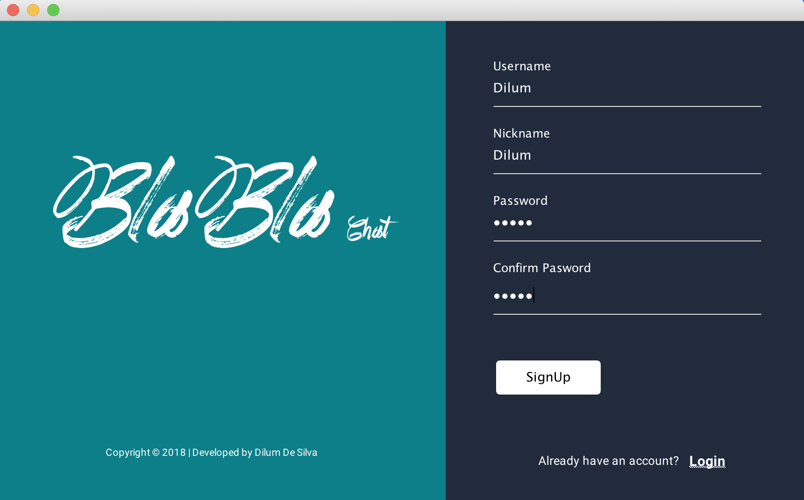
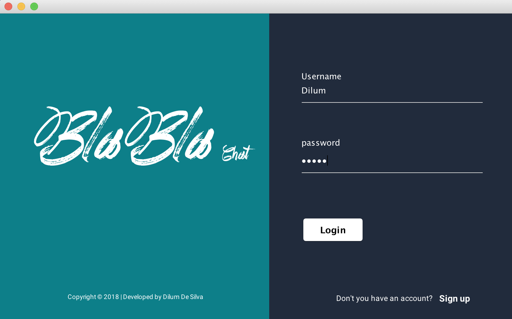
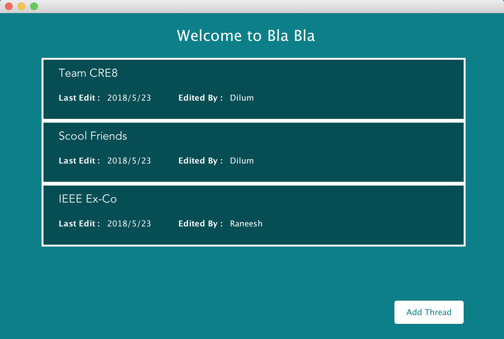
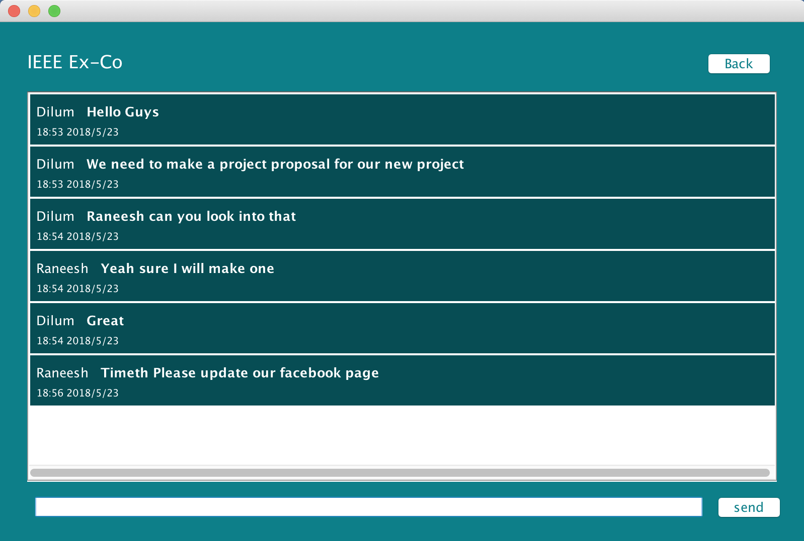

# Bla-Bla-Chat
A chat application based on java web services. I developed this application to improve my knowledge related to Client Server Architecture module.

## Functionalities of Bla-Bla Chat

* Users can manage acounts (Login/Register funtion).
* Users can create sperate chat threads according to the context of the chat.
* Any number of users can use the application to chat at the same time.

## Main screens of the application 

1. Register User Screen

2. Login User Screen

3. Threads Screen

4. Message Screen

